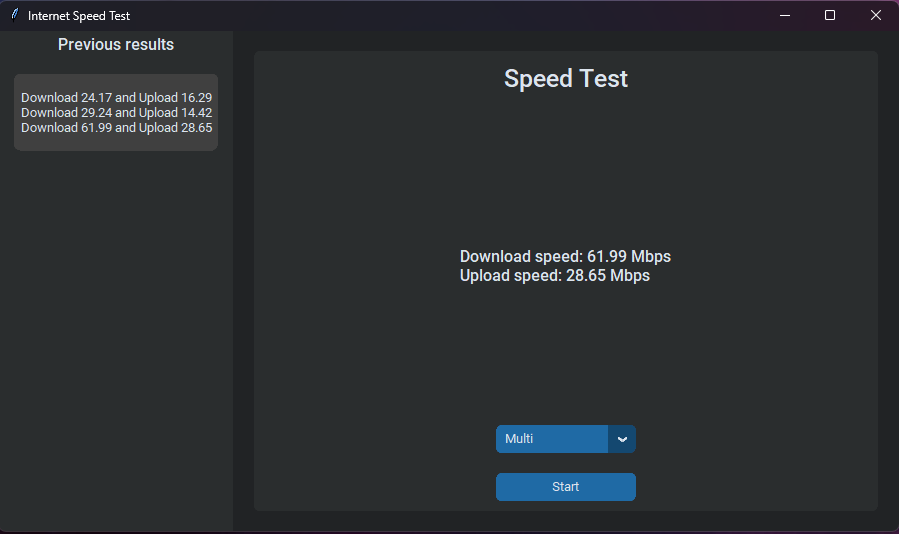

# Simple internet speed test



## Modules

- Tkinter (or more precisely customtkinter)
- Speedtest

To install the modules just run the following command in your terminal ```pip -r install requirements.txt```

## How to use the program

To use the program just run the python script and click the start button.